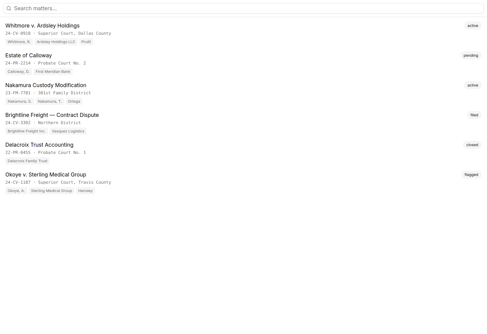
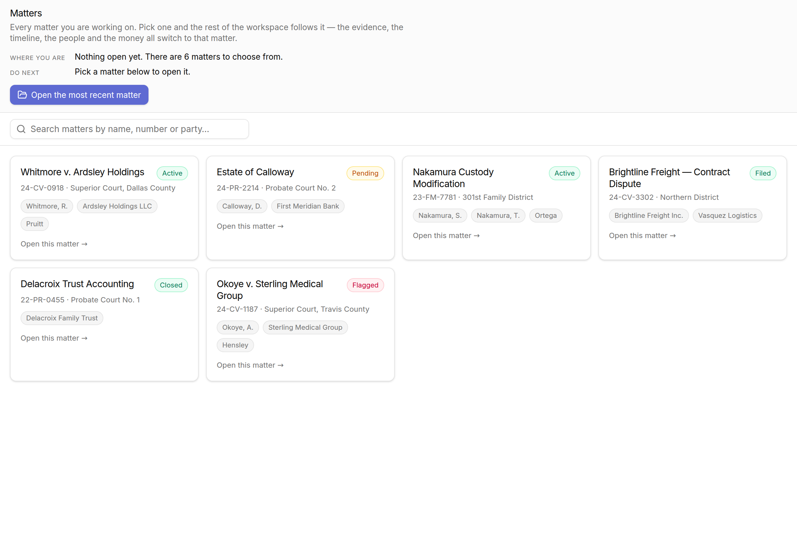
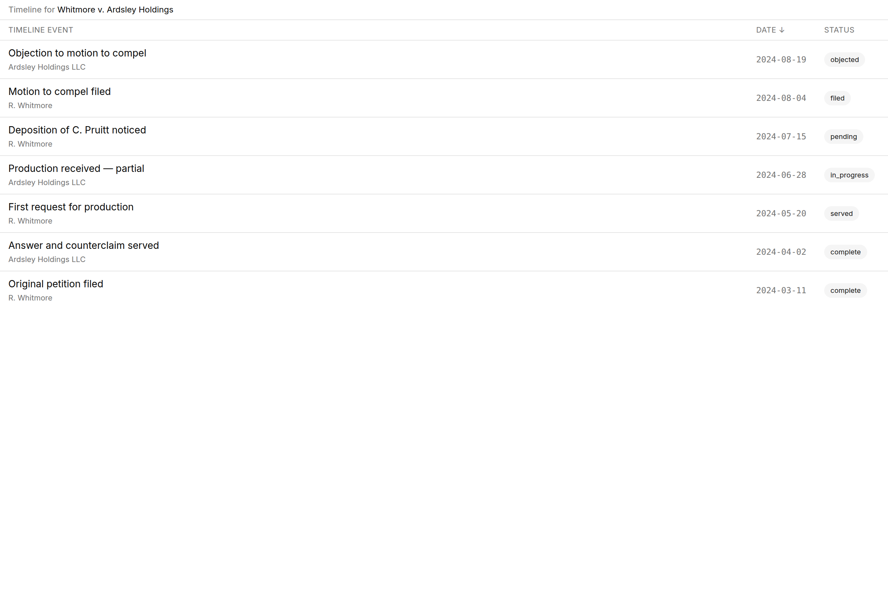
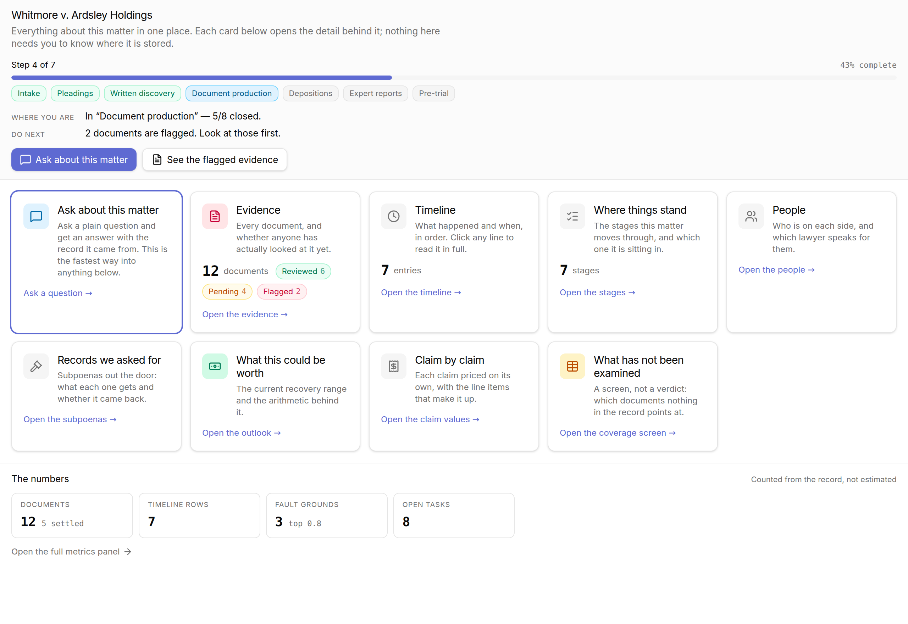
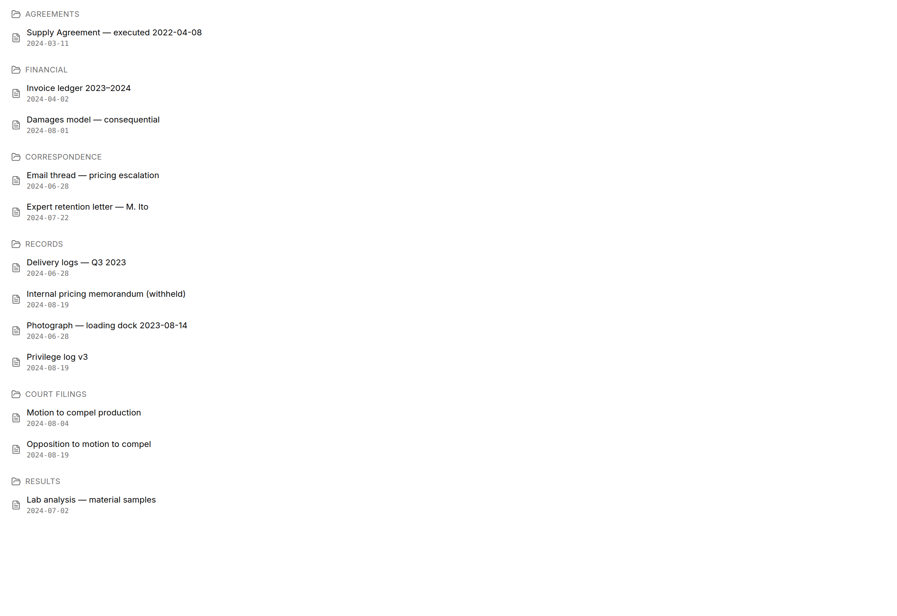
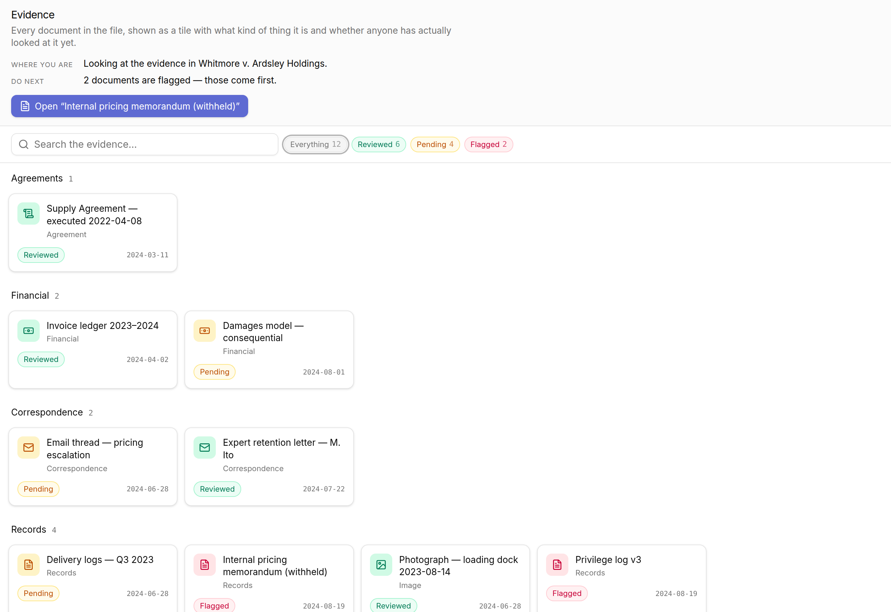
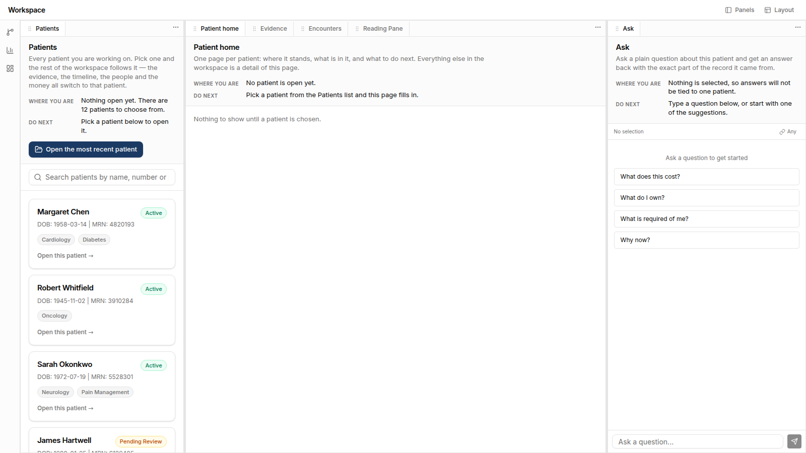

# D-LDUX-2 — the Bolt evidence-portal idiom, before and after

Dave's ruling of 2026-08-10: the Bolt-built legal app (his *Divorce Litigation Case
Management* project, including its evidence portal) was **easier to understand** than
this shell. This change adopts that idiom onto the Law Dog profile.

Dave's binding amendment the same day: **explain-first on every screen.** A
plain-English header block sits *above* the functional components, always — what this
screen is in one sentence a non-lawyer understands, where you are in the matter right
now, and what to do next with the primary action right there. The dense panels render
*below* that block. Never first.

## Where the design source came from

There is no Bolt export of the legal app in the org. Searched
`dmotheral3-eng` on 2026-08-11: three repos exist — `universal-workspace-shell`,
`centripetal-identity`, `cre-centripetal-site` — and a code search for
`"Divorce Litigation"` across the org returns zero hits. The idiom is therefore
**emulated from the ruling's description**, not copied from an export. Nothing was
wholesale-deployed (pin2ajox standing finding holds by default: there was nothing
to deploy).

## Before / after

Each pair is the same panel code, same fixture rows, same viewport (1280×880 at 2×).

### Matters

| before | after |
| --- | --- |
|  |  |

A search box over a dense list of rows, with no statement of what the screen is for
→ a title, one sentence, a count of what is open, an instruction, one obvious primary
action, and then **cards** with a large plain-English name, the court and cause number
on one line, a coloured status chip and party chips.

### A matter detail

| before | after |
| --- | --- |
|  |  |

**There was no matter-detail screen before.** The Classic layout's centre column
landed on the timeline table, so that table is what stands in for "a matter detail" in
the before column — which is the finding, not a straw man.

After is the new `MatterHome` panel, in the order the ruling fixes:

1. **the explainer + orientation strip** — matter name, one sentence, a
   *Step 4 of 7 · 43% complete* progress bar, one chip per stage with the current one
   picked out, `WHERE YOU ARE` / `DO NEXT`, and the primary action ("Ask about this
   matter") beside a secondary one that appears only when there is flagged evidence;
2. **the card grid** — plain-English section titles ("Evidence", "Where things stand",
   "Records we asked for", "What this could be worth", "What has not been examined"),
   a one-line description each, counts, and status chips;
3. **the dense panel** — "The numbers", last.

Cards are offered only for panels the active profile registers, so the healthcare demo
profile does not advertise subpoenas.

### Evidence

| before | after |
| --- | --- |
|  |  |

A folder tree of filenames → the portal idiom: explain block on top with the count
that matters ("2 documents are flagged — those come first") and a primary action that
opens that exact document; then clickable count chips
(`Everything 12 · Reviewed 6 · Pending 4 · Flagged 2`) that double as filters; then
**tiles** grouped by category, each with an icon chosen from what the document *is*
(agreement, email, photograph, court filing, financial, lab result) and a coloured
status chip.

## How the shots were made

`bash scripts/ldux2-proof.sh` regenerates all six.

- **after** builds the working tree; **before** builds a worktree at `origin/main`.
- Both use `vite.proof.config.ts`, which aliases `@/data` to `proof/data-shim.ts` and
  writes to `dist-proof/`. Nothing in `src/` knows the harness exists and no proof
  code can reach the shipped bundle — `index.html`, `popout.html` and `panels.html`
  are untouched.
- Rows come from `proof/fixtures.ts`. They are **invented**, shaped like the live
  columns, and run through the panels exactly as they ship.

Fixtures rather than live rows, for the same reason `panels.html` exists: `anon` holds
no grant on any `legal.ld_*` table, so an anonymous build renders every legal panel
empty **by design**. See the auth note at the top of `src/data/lawdog-provider.ts`.
Nothing here is a workaround for that; it is the sanctioned way to photograph a
populated panel.

The before harness (`proof/proof-app-before.tsx`) differs from the after harness in
exactly one line — which panel stands in for the matter detail — because that panel
did not exist yet.

## Sequencing note — D-LDUX-1 is NOT in this repo

The task sequenced this work after D-LDUX-1 (`3ea6295d`, coloured nav) merged. **It
has not merged, and no branch on `dmotheral3-eng/universal-workspace-shell` carries
it** (checked 2026-08-11: `main` is `2011c16`; the two `claude/*` branches are
D-LDPANEL-1 and D-LDAUTH-PKCE-1). This change was therefore built on `main` as it
stands, and deliberately kept off LDUX-1's likely ground to avoid a conflicting UI PR:

- **Nothing in the workspace header or the collapsed rail was restyled.** The only
  edits to `workspace-header.tsx` and `collapsed-rail.tsx` are one new panel entry
  (`MatterHome`) and two label renames (Assistant → Ask, Documents → Evidence).
- **Colour comes from the profile's existing brand accent**, read through
  `getBrand().accent` — the same token a coloured nav would use. It is not a second,
  competing palette.
- The Ask rail keeps full height in the rebuilt Classic layout, so chat stays visually
  primary as LDUX-1 requires.

If LDUX-1 lands afterwards, the expected conflicts are `presets.ts` (both touch the
Classic layout) and the two label maps. Nothing else overlaps.

## What was kept intact

- **Tenant scoping.** No query, filter or `Accept-Profile` header changed. The one
  provider edit is additive: `toDoc()` now also carries the store's own posture column
  into `Document.status` (`ld_documents.status` on the cube store,
  `documents.completeness` on the dave-legal store) so the evidence view has something
  to colour. Nothing new is read and nothing is read wider.
- **The six legal panels' fixed-light palette and single-accent rule** — the explainer
  added to `LdPanelFrame` is written in `ld-kit`'s own literal hex, not theme tokens,
  and adds no second accent.
- **The `panels.html` fixture harness**, updated to show the same explain copy the app
  shows (each legal panel exports its own `*_EXPLAIN` block, imported by both).
- **The default (healthcare, mock) profile.** All copy is vocabulary-driven, so it
  reads as "Patients"/"Encounters" there and still builds and runs with no login.

## Whole-shell smoke shot

The rebuilt Classic layout on the **default (healthcare, mock) profile**, no login —
the list on the left, `MatterHome` (rendered as "Patient home" from that profile's
vocabulary) leading the centre column with Evidence, Encounters and the Reading Pane
one tab across, and the Ask rail at full height on the right. Every panel visible
carries its explain block above its components, and every word of it is
vocabulary-driven.
