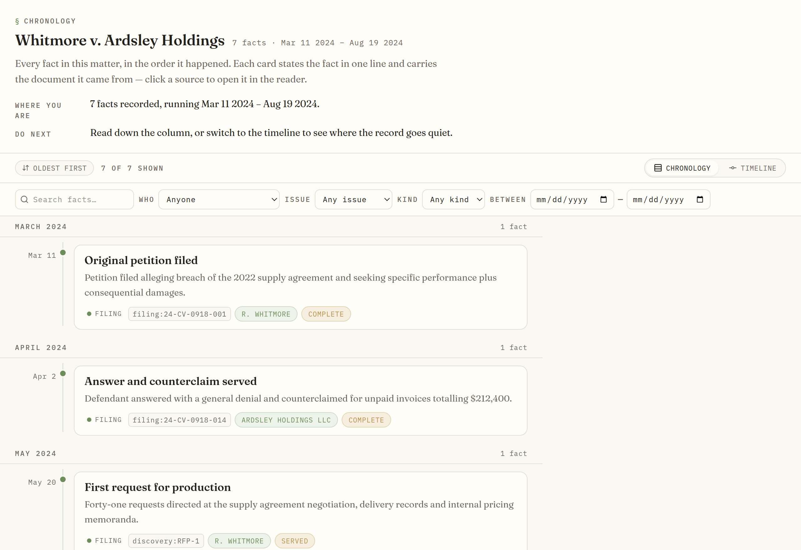
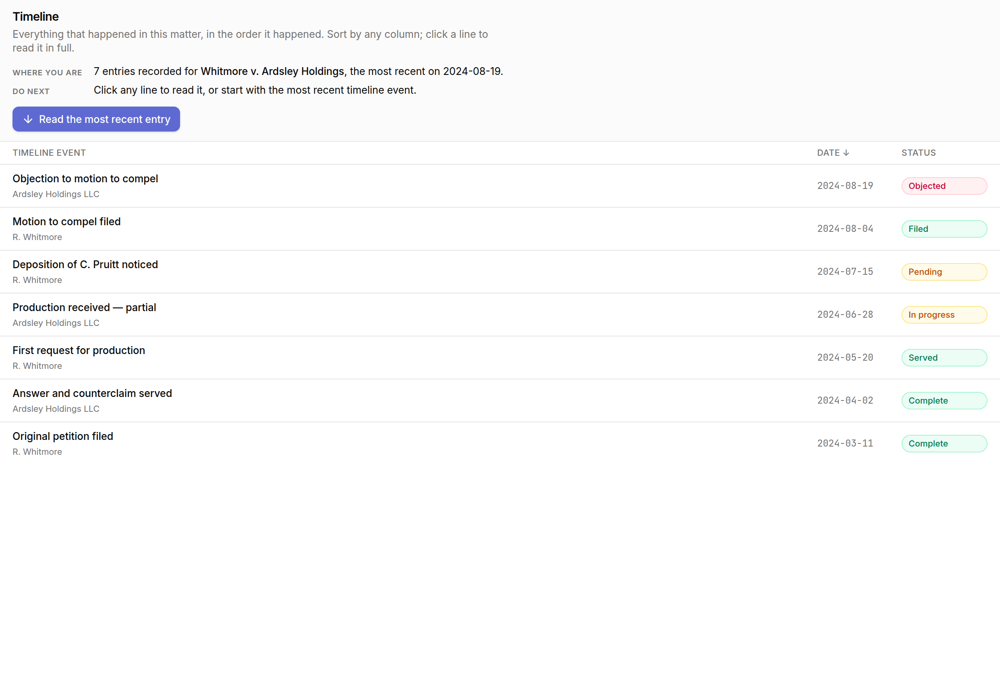
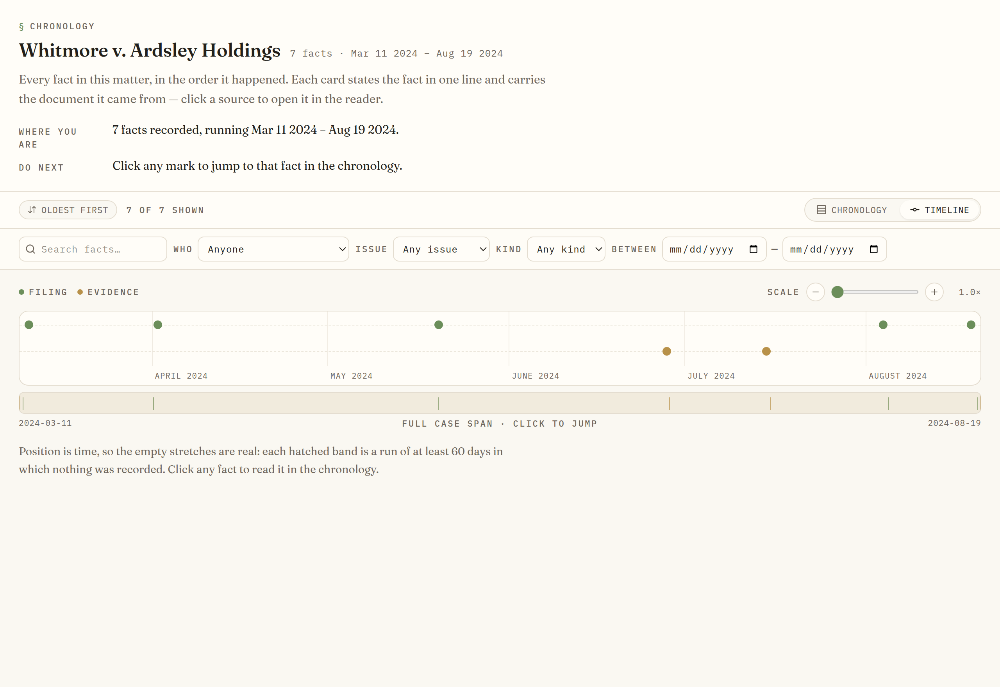
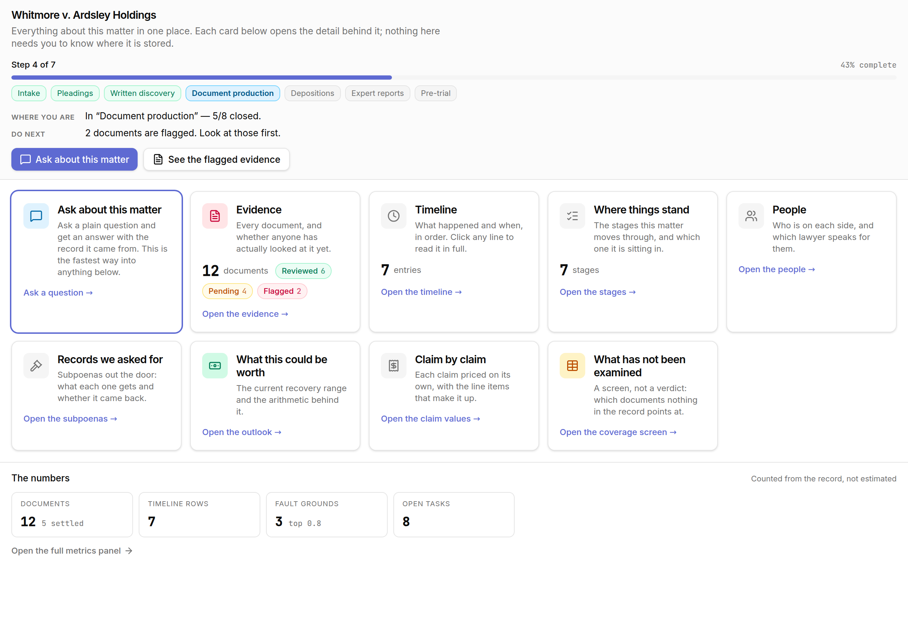
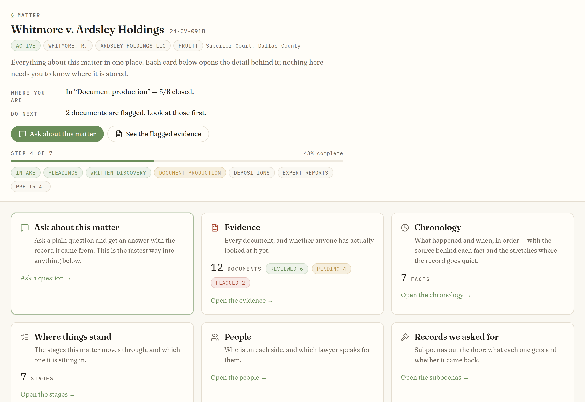
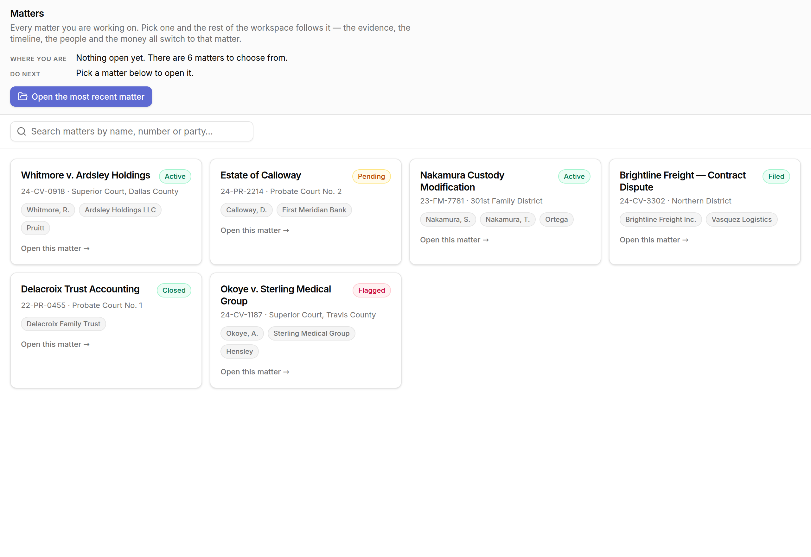
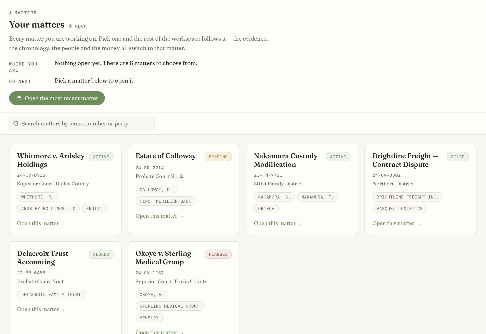
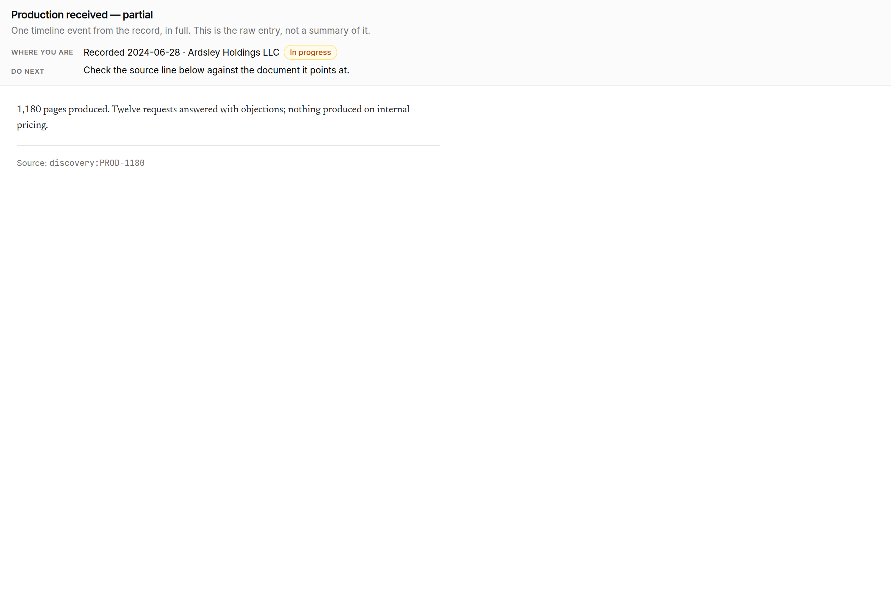
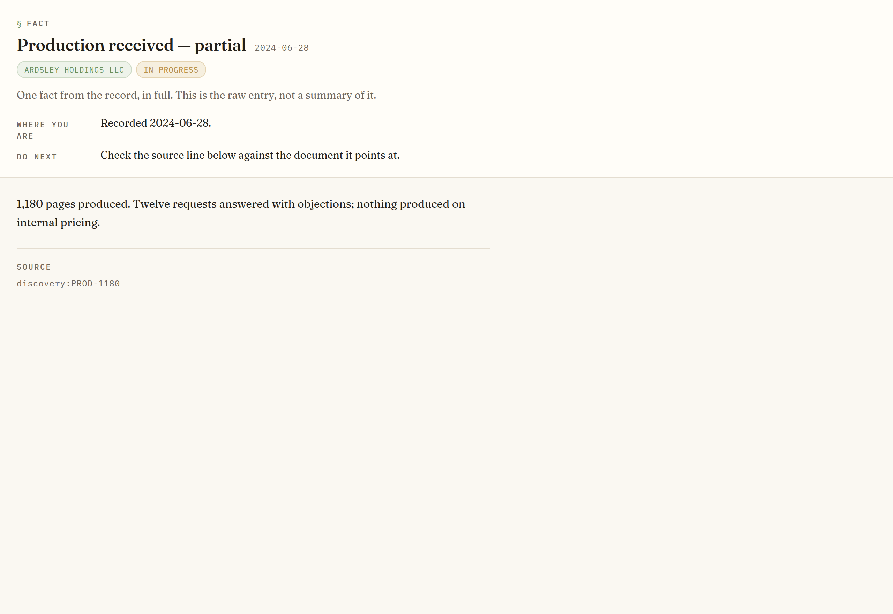

# D-LDUX-5 — a readable case chronology, before and after

Dave's brief, verbatim: *"make this easy to read… find some interface that looks at
timelines… what is a good law or case interface… we had nice ones before… make this
nicer or more easy to read."*

Two references, blended:

**A. Litigation chronology tools** (Casefleet's chronology/timeline dual view,
Everchron's card view). Their shared anatomy is the **fact card**: a date, a bold
one-line headline stating the fact as a lawyer would state it, one or two lines of
summary, source-document chips, people chips, issue tags — and every card clicks
through to its evidence.

**B. The Centripetal house editorial look**, live at cre.centripetal-ai.com
(`dmotheral3-eng/cre-centripetal-site`, `index.html`). Fraunces for reading text,
IBM Plex Mono for eyebrows, dates and ids; paper ground, hairline-ruled cards, pill
tags, line-height 1.65, generous whitespace.

The house look is adapted **into** the shell's existing React + shadcn/Tailwind
theme as `--ed-*` tokens and `bg-ed-*` / `text-ed-*` / `border-ed-*` utilities. It is
not a second style system: the chrome (tab bars, dialogs, the six legal data panels)
keeps the tokens it had.

## Before / after

Each pair is the same panel code, same fixture rows, same viewport (1280×880 at 2×),
photographed by `bash scripts/ldux5-proof.sh`. The before column is a worktree at
`origin/main`; the after column is this branch. The only variable is the panel code.

### The chronology — reading view

| before | after |
| --- | --- |
|  |  |

A three-column sortable table with a truncated title, a date and a status chip → a
single ~72ch reading column with sticky month eyebrows (`MARCH 2024`), a mono date
rail threaded by a sage hairline, and a **fact card** per row: Fraunces headline at
17.5px/560, a two-line clamped summary that expands on click, and a chip row
carrying the type marker (dot **and** label), the source document, the party and the
phase. Long silences between facts are called out in place — *"5 months, no record"*.
Facts dated after today gather under a `COMING UP` divider, and anything derived as
a deadline takes the attention strip.

### The chronology — density view

| before | after |
| --- | --- |
|  |  |

There was no density view; the before column is the same table. After: time is the
horizontal axis and position is proportional to it, one lane per kind of fact, month
ticks, a scale control from 1× to 12×, and a slim minimap of the full case span with
the current window drawn on it. **Gaps read as gaps** — every run of ≥60 days with
nothing in it is hatched and labelled, which is the "where is the record silent"
question answered by the shape of the screen rather than by a query. Hover or focus
gives the headline; click switches to the chronology anchored on that fact.

### The matter home

| before | after |
| --- | --- |
|  |  |

Same reading order as D-LDUX-2 established (explainer → cards → numbers), re-set in
the editorial face: mono uppercase `WHERE YOU ARE` / `DO NEXT` labels with Fraunces
answers, the cause number in mono beside the matter name, parties and status as
pills, and a card grid at 300px minimum instead of the cramped 240px auto-fill.

### The matters list

| before | after |
| --- | --- |
|  |  |

The specific readability failure fixed here: a long matter name used to wrap to as
many lines as it wanted and push the rest of the card out of view. It now clamps at
two lines and carries the full name in `title`. Cause number in mono, court in
prose, parties as pills, status pill on `ok` / `gold` / `attn` semantics, and one
obvious way in.

### The reader

| before | after |
| --- | --- |
|  |  |

The reader is where both a fact card and an evidence tile land, so it moved with
them: one column, Fraunces at 16px/1.65, provenance in mono under a rule. Nothing is
summarised, which has not changed — only the type has.

### The Ask rail

Not in the proof set: the harness photographs one panel per page load and cannot
click, and an Ask answer only exists after a question. In the shipped panel an answer
now renders as a **record-answers card** — `§ THE RECORD ANSWERS` eyebrow, prose in
Fraunces at reading size, figures lifted out of the prose into fig boxes, citations
as source chips under a `WHERE THIS CAME FROM` rule — and when the answer is that the
record does not hold the answer, the whole card goes sage-soft and the eyebrow says
so. "The record does not say" is a finding, and must not look like a failure.
Suggested questions are quiet outlined chips.

## Token mapping added

`src/index.css`, verbatim from the house palette for `:root`, and adapted — not
re-picked — for `.dark`, so a workspace running dark reads as warm paper rather than
as a lit screen.

| house token | shell variable | Tailwind utility | used for |
| --- | --- | --- | --- |
| `--paper` `#FAF8F2` | `--ed-paper` | `bg-ed-paper` | the reading ground |
| `--card` `#FFFDF8` | `--ed-card` | `bg-ed-card` | fact cards, headers, toolbars |
| `--ink` `#231f1a` | `--ed-ink` | `text-ed-ink` | headlines, answers, body |
| `--muted` `#6f675d` | `--ed-muted` | `text-ed-muted` | summaries, eyebrows, meta |
| `--rule` `#e4ddd0` | `--ed-rule` | `border-ed-rule` | every hairline |
| `--sage` `#6B8E5A` | `--ed-sage` | `text-ed-sage` `bg-ed-sage` | the thread, primary action, "ok" |
| `--sage-soft` `#eef3ea` | `--ed-sage-soft` | `bg-ed-sage-soft` | people pills, the honesty card |
| `--gold` `#B89149` | `--ed-gold` | `text-ed-gold` | issue pills, focus rings, selection |
| `--gold-soft` `#f6efdf` | `--ed-gold-soft` | `bg-ed-gold-soft` | issue and phase pills |
| `--attn` `#a8442f` | `--ed-attn` | `text-ed-attn` | deadlines, `COMING UP`, flagged |
| `--attn-soft` `#f8eae7` | `--ed-attn-soft` | `bg-ed-attn-soft` | the deadline strip |

Faces: `--font-editorial` (Fraunces, variable, `opsz` axis) and `--font-edmono`
(IBM Plex Mono), loaded the way the shell already loads faces — one Google Fonts
stylesheet with `display=swap` in `index.html`, `popout.html`, `panels.html` and the
proof harness. Helper classes `.ed-serif`, `.ed-serif-display`, `.ed-mono`,
`.ed-eyebrow`, `.ed-focus` carry the variation settings and the gold focus ring;
`prefers-reduced-motion` is honoured by `.ed-motion` and every transition is a
150–250ms fade.

## Derived fields — declared

This is a presentation change. No schema moved, no column was added, and the panels
read the same `DataProvider` they read before. Everything on a fact card comes off
the existing `Item`:

| card element | source |
| --- | --- |
| headline | `item.title` — the cube store's `timeline_events.event_type`, an enum, so it is humanised (`claim_denied` → "Claim denied"); a blank one falls back to the first clause of the description |
| summary | `item.summary` (`description`) |
| date | `item.date` (`event_date`) |
| who (sage pill) | `item.type` — cube `actor`, case store `who` |
| source chip | `item.evidenceSource` — cube `provenance_kind:provenance_ref — note` |
| issue pills (gold) | `item.statute` (public store only) and `item.status` (`phase`) |
| **fact type** | **derived — see below** |

**Fact type is not in the record.** Neither store has a column for it, and the brief
asks for filing / evidence / communication / deadline / event. It is inferred in
`src/panels/chronology/fact-model.ts` from the event type, the phase and the
description by a keyword table, in that precedence order — a "motion filing deadline"
is a deadline before it is a filing, because the clock is the thing a reader must not
miss. It always resolves: the fallback is `event`, which is the honest reading of
"the record says something happened and does not say what kind". Colour is never the
only carrier — every type renders as a coloured dot **and** a mono label, in both
views and in the legend.

Two smaller derivations, both from fields already on screen elsewhere:

* **Cause number** — the first segment of `Entity.subtitle`, which the provider
  already builds as `case_number · court`. If that segment carries no digit the whole
  subtitle is shown as mono meta instead.
* **Source resolution** — a source chip matches its document by id, then by exact
  title, then by basename, and opens it in the reader. Provenance is free text, not a
  foreign key, so when nothing answers to the name the chip opens the *fact* rather
  than guessing at a document. A wrong document opened quietly would be worse.

## Not touched

Auth, the data layer, the bus contracts, panel registration, and the six legal data
panels (`src/panels/legal/*`), which keep their fixed Linear palette by the ruling at
the top of `ld-kit.tsx` — they are tables of figures, not reading surfaces. The
evidence browser and the remaining collapsed-rail panels still use the D-LDUX-2
explain kit in `panels/explain.tsx`; moving them into the editorial face is the
obvious follow-up and was out of this dispatch's scope.

One label change in `src/config/lawdog.config.json`: the Law Dog vocabulary now says
`Fact` / `Chronology` where it said `Timeline Event` / `Timeline`, so the tab, the
matter-home card and the panel header all read "Chronology". That is profile
vocabulary, not registration — `PanelType` is still `ItemTable`.

## Regenerating

```
bash scripts/ldux5-proof.sh     # needs node_modules and a chrome on PATH
```
